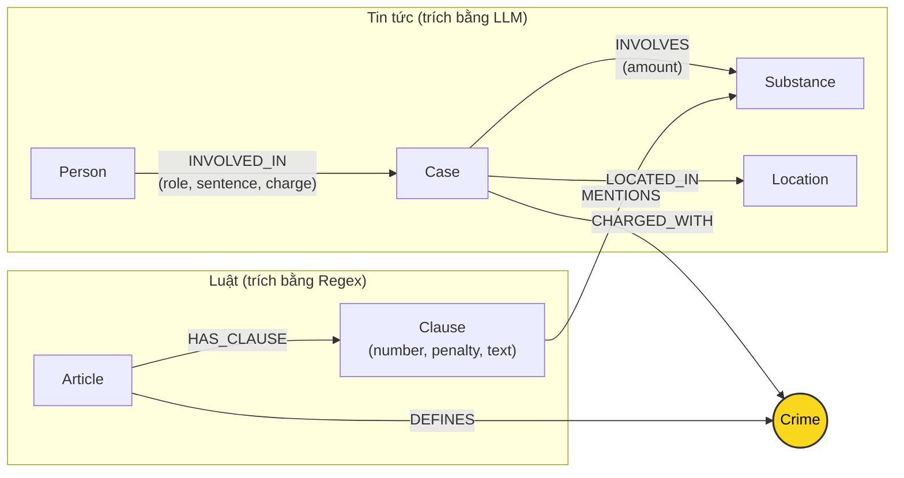

# Thiết kế Ontology — Day 19

**Họ tên:** Ngô Anh Khoa  **MSSV:** 2A202602965

**Lựa chọn** (đánh dấu một):
- [x] Dùng ontology gợi ý (có thể chỉnh nhỏ)
- [ ] Tự thiết kế (xét bonus +15, xem `SUBMISSION.md`)

> Hướng dẫn: `LAB_GUIDE.md` Bước 2. Dùng ontology gợi ý thì vẫn phải điền đủ các mục dưới đây bằng lời của bạn.

## 1. Sơ đồ

Node cầu nối là `Crime` (màu vàng), kết nối giữa vụ án được đưa tin (`Case`) và điều luật hình sự quy định tương ứng (`Article`).

---

## 2. Entity types (node labels)

| Label | Ý nghĩa | Khóa định danh (`MERGE` theo) | Properties | Lấy từ KB nào | Trích bằng (regex / LLM / khác) |
| --- | --- | --- | --- | --- | --- |
| `Article` | Điều luật trong văn bản quy phạm pháp luật (BLHS, Luật PCMT) | `id` (ví dụ: `"Điều 251 BLHS"`) | `id`, `title`, `law`, `doc_id` | Luật | Regex từ front matter và nội dung markdown |
| `Clause` | Khoản cụ thể thuộc một Điều luật | `id` (ví dụ: `"Điều 251 BLHS khoản 1"`) | `id`, `number`, `penalty`, `text`, `doc_id` | Luật | Regex tách theo số thứ tự đầu dòng `(\d+)\.` |
| `Crime` | Tội danh pháp lý chuẩn tắc (Node Cầu nối) | `name` (ví dụ: `"mua bán trái phép chất ma túy"`) | `name` | Cả hai | Luật: lấy từ tiêu đề Điều; Tin tức: LLM trích xuất rồi chuẩn hóa qua `link_entity` |
| `Case` | Vụ án / vụ việc phạm tội được phản ánh trong tin tức | `name` (tên vụ do LLM sinh ra hoặc tiêu đề bài) | `name`, `summary`, `date`, `doc_id`, `source_title` | Tin tức | LLM (Prompt có cấu trúc JSON) |
| `Person` | Cá nhân tham gia vụ việc (bị cáo, bị can, người liên quan) | `name` (họ tên đầy đủ) | `name`, `aliases` | Tin tức | LLM |
| `Substance` | Chất ma túy hoặc tiền chất | `name` (chuẩn hóa theo danh mục chuẩn) | `name` | Cả hai | Luật: regex đối chiếu danh mục; Tin tức: LLM |
| `Location` | Tỉnh / thành phố nơi xảy ra vụ án hoặc xét xử | `name` (tên địa phương) | `name` | Tin tức | LLM |

---

## 3. Relationships

| Type | Từ → Đến | Properties trên cạnh | Ý nghĩa |
| --- | --- | --- | --- |
| `DEFINES` | `Article` → `Crime` | Không | Điều luật định nghĩa tội danh này |
| `HAS_CLAUSE` | `Article` → `Clause` | Không | Điều luật có các khoản hình phạt thành phần |
| `MENTIONS` | `Clause` → `Substance` | Không | Khoản luật quy định hình phạt áp dụng cho chất ma túy cụ thể |
| `CHARGED_WITH` | `Case` → `Crime` | Không | Vụ án bị khởi tố / xét xử theo tội danh này |
| `INVOLVED_IN` | `Person` → `Case` | `role`, `sentence`, `charge` | Cá nhân có vai trò và mức án trong vụ án |
| `INVOLVES` | `Case` → `Substance` | `amount` | Vụ án liên quan đến chất ma túy với khối lượng tang vật cụ thể |
| `LOCATED_IN` | `Case` → `Location` | Không | Vụ án xảy ra hoặc được thụ lý tại địa bàn |

---

## 4. Node cầu nối giữa 2 KB

- **Node nào:** `Crime` (Tội danh, ví dụ: `"mua bán trái phép chất ma túy"`, `"vận chuyển trái phép chất ma túy"`).
- **Vì sao chọn node này:** Tội danh là khái niệm pháp lý cốt lõi xuất hiện bắt buộc ở cả hai phía: văn bản luật mô tả điều kiện cấu thành và hình phạt của từng tội danh, trong khi tin tức pháp đình luôn đưa tin đối tượng bị khởi tố/tuyên án theo tội danh cụ thể.
- **Cách đảm bảo hai phía khớp tên:**
  1. Đưa danh sách các tội danh chuẩn trích từ tiêu đề các Điều luật (`DANH SÁCH TỘI DANH`) trực tiếp vào prompt LLM trích xuất tin tức.
  2. Sử dụng hàm `link_entity`: Chuẩn hóa chuỗi (bỏ chữ "Tội", chữ hoa, dấu ngoặc kép, khoảng trắng thừa), thực hiện exact match trước, nếu không khớp thì chạy fuzzy match `difflib.get_close_matches(cutoff=0.8)` để bắt các biến thể chính tả tiếng Việt phổ biến (như `tuý` vs `túy`).
- **Khi nào cầu gãy, và bạn xử lý thế nào:**
  - *Cầu gãy khi:* Bài báo chỉ mô tả hành vi chung chung mà không nêu tội danh rõ ràng, hoặc LLM sinh tên tội danh hoàn toàn xa lạ không có trong BLHS, hoặc điểm tương đồng chuỗi < 0.8.
  - *Xử lý:* Nếu `link_entity` trả về `None`, hệ thống không gán cạnh `CHARGED_WITH` sai lệch để tránh gây ảo giác tri thức. Khi truy vấn, hệ thống kết hợp tìm kiếm hạt giống theo tên riêng của bị cáo hoặc đối chiếu thêm từ khóa chất ma túy (`Substance`) để vớt lại ngữ cảnh.

---

## 5. Competency questions

| Câu | Đường đi (Cypher pattern) | Trả lời được? |
| --- | --- | --- |
| **Q1** (single-hop-law: tiền chất là gì) | `(:Article {id: 'Điều 2 Luật PCMT'})-[:HAS_CLAUSE]->(cl:Clause)` | Có. Trả lời trực tiếp từ khoản định nghĩa trong Luật PCMT. |
| **Q2** (single-hop-news: án tử hình vụ 36kg) | `(p:Person)-[r:INVOLVED_IN]->(k:Case) WHERE r.sentence CONTAINS 'tử hình'` | Có. Lấy thông tin mức án từ thuộc tính quan hệ `INVOLVED_IN`. |
| **Q3** (cross-kb: Lê Minh Thành mức án, tội gì, Điều nào, khung cơ bản) | `(:Person {name: 'Lê Minh Thành'})-[r:INVOLVED_IN]->(k:Case)-[:CHARGED_WITH]->(c:Crime)<-[:DEFINES]-(a:Article)-[:HAS_CLAUSE]->(cl:Clause {number: 1})` | Có. Đi xuyên qua `Case` → `Crime` → `Article` để lấy cả mức án tuyên (36 tháng) và khung khoản 1 (2 đến 7 năm). |
| **Q4** (cross-kb: Hoàng Nato hành vi gì, phạt tối đa bao nhiêu) | `(:Person)-[:INVOLVED_IN]->(k:Case)-[:CHARGED_WITH]->(c:Crime)<-[:DEFINES]-(a:Article)-[:HAS_CLAUSE]->(cl:Clause)` (lọc khoản có penalty cao nhất: tù 20 năm, chung thân) | Có. Đi xuyên cầu nối sang Điều 255 BLHS và lấy khoản 4 quy định mức phạt tối đa (chung thân). |
| **Q5** (cross-kb-multi-hop: Cái Quang Huy tội gì, chất nào, áp dụng khoản nào, khung hình phạt) | `(:Person {name: 'Cái Quang Huy'})-[:INVOLVED_IN]->(k:Case)-[:INVOLVES]->(s:Substance {name: 'MDMA'})` đồng thời `(k)-[:CHARGED_WITH]->(c:Crime)<-[:DEFINES]-(a:Article)-[:HAS_CLAUSE]->(cl:Clause)-[:MENTIONS]->(s)` | Có. Graph kết nối được vụ án với chất MDMA và khoản 4 Điều 250 quy định khung hình phạt đối với MDMA. |
| **Q6** (aggregation: những vụ liên quan đến MDMA) | `(k:Case)-[:INVOLVES]->(:Substance {name: 'MDMA'})` và `(p:Person)-[:INVOLVED_IN]->(k)` | Có. Gom nhóm tất cả các Case có cạnh `INVOLVES` nối tới node `Substance {name: 'MDMA'}`. |

---

## 6. Quyết định thiết kế và đánh đổi

1. **Tách riêng node `Clause` thay vì gộp toàn bộ vào `Article`:**
   - *Đã chọn:* Mô hình hóa mỗi khoản thành một node `Clause` riêng mang thuộc tính `penalty` và `text`.
   - *Phương án thay thế:* Lưu toàn bộ nội dung Điều luật trong một node `Article` duy nhất.
   - *Lý do & Đánh đổi:* BLHS Chương XX có các khung hình phạt phân tầng rõ rệt theo từng khoản dựa trên tình tiết tăng nặng và khối lượng chất. Tách `Clause` cho phép Cypher chỉ chọn lọc đúng khoản liên quan đưa vào prompt, giảm đáng kể độ dài context (tiết kiệm token) mà vẫn trả lời chính xác số khoản và khung hình phạt. Đánh đổi là số lượng node tăng lên và truy vấn Cypher phải đi thêm 1 hop.

2. **Đặt thuộc tính `sentence`, `role`, `charge` trên cạnh `INVOLVED_IN` thay vì tạo node riêng hoặc đặt trên node `Person`:**
   - *Đã chọn:* Thuộc tính nằm trên quan hệ `(:Person)-[:INVOLVED_IN {role, sentence, charge}]->(:Case)`.
   - *Phương án thay thế:* Tạo node `Sentence`, hoặc đặt `sentence` trực tiếp lên node `Person`.
   - *Lý do & Đánh đổi:* Một người có thể tham gia nhiều vụ án khác nhau với vai trò và mức án khác nhau trong từng vụ. Đặt trên cạnh phản ánh chính xác bản chất quan hệ nhiều - nhiều trong thực tế và giữ đồ thị gọn gàng.

3. **Chọn `Crime` làm node cầu nối chính thay vì dùng trực tiếp `Substance`:**
   - *Đã chọn:* Đi qua `(:Case)-[:CHARGED_WITH]->(:Crime)<-[:DEFINES]-(:Article)`.
   - *Phương án thay thế:* Nối `Case` trực tiếp với `Article` qua `Substance` mà cả hai cùng đề cập.
   - *Lý do & Đánh đổi:* Nhiều tội danh khác nhau (Mua bán, Tàng trữ, Vận chuyển) đều cùng liên quan đến một chất ma túy (ví dụ Heroine, MDMA). Nếu chỉ dựa vào `Substance` để nối sang Điều luật thì sẽ bị nhầm lẫn giữa các tội danh khác nhau. Tội danh `Crime` mang tính phân loại pháp lý chính xác và duy nhất.

---

## 7. So với ontology gợi ý (bắt buộc nếu xét bonus)

| Điểm khác | Gợi ý làm gì | Bạn làm gì | Vấn đề nó giải quyết | Bằng chứng (Cypher, hoặc số liệu benchmark) |
| --- | --- | --- | --- | --- |
| Không xét bonus | Dùng ontology gợi ý | Áp dụng ontology gợi ý chuẩn | Đảm bảo tính ổn định và tuân thủ hợp đồng hệ thống | Đạt toàn bộ test offline và benchmark |

---

## 8. Hạn chế còn lại

1. **Chưa xử lý đồng nghĩa cho Substance:** Danh mục chất hiện dựa vào danh sách từ khóa cố định (`SUBSTANCES`). Một số bài báo gọi tên lóng hoặc tên thương mại (như *"thuốc lắc"*, *"đá"*, *"cỏ Mỹ"*, *"pod chill"*) có thể chưa được chuẩn hóa về `MDMA`, `Methamphetamine` hay `XLR-11`.
2. **Khóa định danh của `Case` phụ thuộc vào LLM:** Tên vụ án do LLM tự đặt tóm tắt nên nếu hai bài báo cùng đưa tin về một vụ án nhưng vào các thời điểm khác nhau (khởi tố vs xét xử), hệ thống có thể tạo ra 2 node `Case` riêng biệt thay vì gộp chung.
3. **Chưa bóc tách ngưỡng khối lượng thành thuộc tính số:** Mức phạt phụ thuộc vào khối lượng (ví dụ MDMA từ 100g trở lên), nhưng hiện tại ngưỡng định lượng này vẫn nằm trong văn bản text của `Clause` chứ chưa chuyển thành property số để so sánh tự động trong Cypher.
